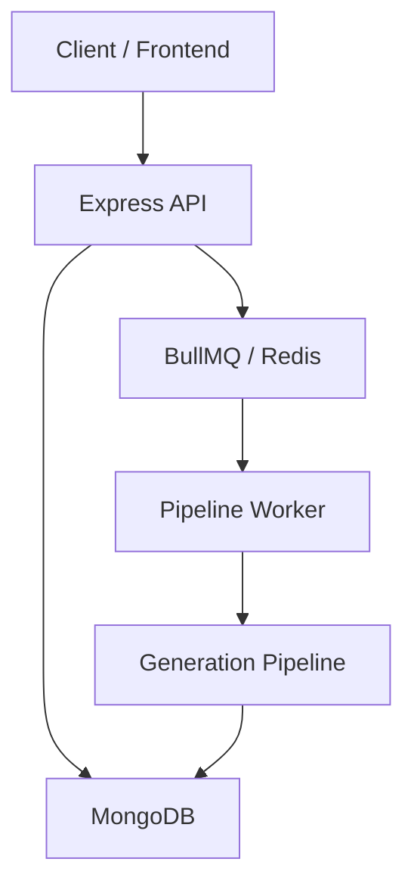

# AI Interview Prep Kit — Backend

This backend turns a **job description**, **company URL**, and **preparation days** into a structured interview-preparation kit. Generation runs asynchronously through a staged pipeline that combines LLM synthesis with deterministic application logic.

The system supports:

- asynchronous kit generation (BullMQ + Redis)
- company research and evidence-grounded briefs
- requirement extraction with stable IDs
- question generation and deterministic coverage validation
- flashcards and a deterministic study schedule
- editable kits with safe section regeneration
- practice-mode confidence tracking and analytics
- a developer batch evaluator CLI

---

## 1. Architecture



| Component | Responsibility |
|-----------|----------------|
| **Express** | HTTP API, auth, request validation, SSE progress |
| **MongoDB** | Durable kit state, user data, practice attempts |
| **Redis / BullMQ** | Job queue, retries, concurrency, stage orchestration |
| **Worker** | Executes one pipeline stage per job |
| **Abstractions** | LLM, search, and HTTP fetch behind provider interfaces |

**Important:** The BullMQ worker starts in the same Node process as the API (`src/app.js` imports `./queue/worker`). Running `npm run dev` or `npm start` starts both the HTTP server and the worker.

MongoDB is the source of truth for business state. Workers may retry or restart; completed stage output is persisted in the kit document before the next stage is enqueued.

---

## 2. Generation Pipeline

```
extract-requirements
        ↓
research-company
        ↓
generate-brief
        ↓
generate-questions
        ↓
check-coverage  ←──┐
        ↓          │ (loop if must-haves uncovered,
generate-flashcards│  up to MAX_COVERAGE_PASSES)
        ↓          │
build-schedule     │
        ↓          │
validate-and-finalize
```

Each stage is a separate BullMQ job with its own handler, validation, and idempotency rules. Stages are intentionally separated rather than collapsed into one LLM call so each step can be validated, retried, and inspected independently.

**Coverage loop:** `check-coverage` is deterministic. If any **must-have** requirement has no linked question, the pipeline re-enqueues `generate-questions` with the uncovered requirement IDs. Nice-to-have gaps do not block the pipeline.

---

## 3. Why the Pipeline Is Designed This Way

**The LLM is a component of the system, not the system itself.**

| LLM-driven | Application code |
|------------|------------------|
| Extract requirements from the JD | Assign stable requirement IDs |
| Synthesize company brief from evidence | Build and deduplicate source URLs |
| Generate questions and flashcards | Validate schemas and references |
| Rank crawl candidates / search queries | Compute coverage |
| | Allocate the study schedule |
| | Run final kit integrity checks |
| | Persist state, enqueue next stage |
| | SSRF checks, robots, timeouts |

This split keeps critical guarantees in testable, deterministic code. The LLM proposes content; the application decides whether that content is structurally valid, referenced correctly, and safe to persist.

---

## 4. Asynchronous Job Architecture

- Jobs are small: each references a `kitId`, `stageName`, and `passNumber`.
- Stage handlers read durable state from MongoDB and write results back before advancing.
- Worker memory is not treated as durable state.
- BullMQ handles orchestration, retries (3 attempts with exponential backoff per stage), and concurrency (worker concurrency: 3).

**Retry behaviour (high level):**

| Stage type | Strategy |
|------------|----------|
| LLM stages | Retry with backoff on transient/provider errors |
| Research / network | Retry with backoff; partial failures recorded, stage can still complete |
| Deterministic stages | Minimal retry — failures usually indicate a bug or bad persisted input |

A failed stage can be retried without re-running completed stages. Completed stage output remains in `kit.results.*` and idempotency guards skip re-work where appropriate.

**Kit statuses:** `queued` → `generating` → `ready` | `failed` | `stalled`

A startup reconciler re-enqueues kits stuck in `queued` or `stalled` (e.g. Redis enqueue failed). Kits in `failed` status cannot be regenerated; create a new kit to retry generation.

---

## 5. Requirement Extraction

```
Requirement
├── id          (application-generated: r1, r2, …)
├── text
├── kind        technical | behavioural | domain
└── priority    must | nice
```

- IDs are assigned by application code after LLM extraction — never trusted from model output.
- Requirements are normalized conservatively (trim, dedupe exact text).
- Explicit OR meaning is preserved.

**Example:** `"Strong Java, Python, or Go skills"` stays as **one** requirement (an alternative), not three independent must-haves.

Thin JDs are accepted. Malformed LLM output is rejected and the stage retries.

---

## 6. Company Research

```
Company URL
   ↓
URL / SSRF validation
   ↓
Fetch homepage (manual redirect handling, per-hop revalidation)
   ↓
Discover links → filter → AI rank → fetch top N pages
   ↓
Search public interview / company discussion (Brave Search)
   ↓
Compact research result (pages + discussion snippets)
```

**Safeguards implemented:**

- SSRF / private-target blocking (with `ALLOW_LOCAL_FETCH_TARGETS` opt-in for batch/local testing)
- Redirect revalidation on every hop
- `robots.txt` checked per origin
- Response size limits, timeouts, content-type filtering
- Hiring-page detection (multi-signal, not single-keyword)
- Partial research failures are non-fatal — the stage completes with whatever evidence was collected

Research content is wrapped in `<evidence>` tags in the brief prompt and explicitly treated as **untrusted data**, not as model instructions.

---

## 7. Company Brief

The brief is synthesized from collected evidence, not from model prior knowledge.

| Field | Source |
|-------|--------|
| `summary`, `what_they_do` | LLM from website evidence |
| `interview_relevance`, `hiring_signals`, `interview_signals` | LLM from hiring/discussion evidence |
| `sources` | **Application-built** from crawled page URLs + search result URLs |

If interview-specific evidence is thin, optional fields remain empty rather than invented. Source URLs are never taken from LLM output.

Users can edit the brief via `PATCH /api/kits/:id/company-brief` (MongoDB only, no LLM).

---

## 8. Question Generation + Coverage

**Question contract:**

```
id, requirement_ids, category, prompt, answer_outline, difficulty
```

**Categories:** `technical` | `behavioural` | `system-design` | `company-fit`  
**Difficulty:** `1` | `2` | `3`

```
Generate questions
       ↓
Deterministic coverage check
       ↓
Any uncovered MUST requirements?
       |
      yes → focused re-generation → coverage check again
       |
      no  → continue to flashcards
```

Coverage is **deterministic application logic**, not an LLM judgment. Only **must-have** requirements must be covered. The loop is bounded by `MAX_COVERAGE_PASSES` (default: 2).

---

## 9. Flashcards

- Generated from validated questions (LLM stage).
- Retain `requirement_ids` from source questions.
- Users can create, edit, delete, reorder, and pin cards via the Builder API.
- Regeneration merges new generated cards with protected content (user-created, edited, or pinned cards are preserved).

---

## 10. Deterministic Schedule

Schedule allocation is pure application logic — the LLM does not decide the schedule.

**Guarantees:**

- Exactly the requested number of days (1–60)
- Every question allocated exactly once (no duplicates, none lost)
- Must-have questions distributed before nice-to-have
- Harder questions placed earlier (difficulty-desc round-robin)
- Deterministic minutes: `question_count × MINUTES_PER_QUESTION`
- Unused days are valid rest days (`focus: "rest"`, `minutes: 0`)

---

## 11. Editable Kit + Regeneration Safety

Each question and flashcard carries content state:

```
origin:   generated | user
edited:   true | false
pinned:   true | false
```

**Preservation rules during regeneration:**

| State | On regenerate |
|-------|---------------|
| User-created | Preserved |
| Edited | Preserved |
| Pinned | Preserved |
| Untouched generated | Replaceable |

Regeneration is **explicit** (`POST /api/kits/:id/regenerate/...`). Normal CRUD edits do not trigger LLM jobs.

**Optimistic concurrency:** `contentRevision` increments on user edits. Regeneration requests can include `contentRevision`; stale requests receive `409 REGENERATION_CONFLICT` instead of overwriting newer edits.

Regeneration is only allowed when `kit.status === "ready"`.

---

## 12. Practice Mode

```
Flashcard → Reveal → Low / Medium / High → Persist attempt → Analytics
```

- Full attempt history is stored (`practice.attempts[]`).
- Current analytics use the **latest attempt per flashcard**.
- Confidence weights: low = 0, medium = 50, high = 100.
- Overall coverage: practiced flashcards / total flashcards.
- Requirement-level strength/weakness is computed deterministically.
- A flashcard linked to multiple requirements contributes to each.
- Custom cards with empty `requirement_ids` count toward global coverage but not requirement analytics.

Practice endpoints do not trigger AI, BullMQ, or `contentRevision` changes.

---

## 13. API Overview

Base path: `/api`

| Area | Method | Endpoint | Purpose |
|------|--------|----------|---------|
| **Auth** | POST | `/auth/register` | Create account |
| | POST | `/auth/login` | Login (JWT cookie) |
| | POST | `/auth/logout` | Logout |
| | GET | `/auth/me` | Current user |
| **Kits** | POST | `/kits` | Create kit and start generation |
| | GET | `/kits` | List user's kits |
| | GET | `/kits/:id` | Get full kit |
| | DELETE | `/kits/:id` | Delete kit |
| **Generation** | GET | `/kits/:id/progress` | SSE generation progress |
| **Builder** | PATCH | `/kits/:id/company-brief` | Edit brief (no LLM) |
| | * | `/kits/:id/requirements/...` | CRUD + reorder requirements |
| | * | `/kits/:id/questions/...` | CRUD + reorder + pin questions |
| | * | `/kits/:id/flashcards/...` | CRUD + reorder + pin flashcards |
| | * | `/kits/:id/schedule/...` | Move/reorder questions, edit day focus |
| **Regeneration** | POST | `/kits/:id/regenerate/brief` | Regenerate company brief |
| | POST | `/kits/:id/regenerate/questions` | Regenerate questions |
| | POST | `/kits/:id/regenerate/flashcards` | Regenerate flashcards |
| **Practice** | GET | `/kits/:id/practice` | Practice summary + analytics |
| | POST | `/kits/:id/practice/flashcards/:flashcardId` | Record confidence |
| **Docs** | GET | `/docs` | Swagger UI |
| | GET | `/openapi.json` | OpenAPI spec |
| **Health** | GET | `/health` | Health check |

All kit routes require authentication (`protect`) and ownership verification (`ownsKit`).

---

## 14. Security & Reliability

| Protection | Implementation |
|------------|----------------|
| Authentication | JWT in HTTP-only cookie |
| Authorization | `ownsKit` middleware on all kit routes |
| External URL validation | SSRF blocking, DNS resolution checks |
| Redirect safety | Manual redirect following with per-hop revalidation |
| Crawl limits | robots.txt, timeouts, max bytes, content-type filter |
| Untrusted content | Research wrapped as data; prompt injection mitigated in brief stage |
| Generated data | Zod / structural validators per stage; final kit integrity check |
| Partial failure | Research and search continue with structured errors |
| Concurrency | `contentRevision` optimistic locking on edits and regeneration |
| Retries | BullMQ exponential backoff (3 attempts per stage) |

Fetched web content is treated as untrusted input throughout the pipeline.

---

## 15. Batch Evaluator

Developer/assessment CLI — not user-facing.

```bash
npm run evaluate -- --input cases.json --output kits.json
```

- No logged-in user required (uses `BATCH_EVAL_USER_ID` or a default system user).
- Processes cases sequentially; one failure does not stop the batch.
- Outputs structured JSON per case (`success` + `kit`, or `failed` + `error`).
- Uses the **same** `createAndEnqueueKit` → BullMQ pipeline as the HTTP API.
- Respects existing SSRF rules; set `ALLOW_LOCAL_FETCH_TARGETS=true` for localhost batch URLs.

**Example `cases.json`:**

```json
[
  {
    "id": "case-phonepe-backend",
    "jd": "Backend Software Engineer. Java, Go, distributed systems...",
    "company_url": "https://www.phonepe.com/",
    "days": 5
  }
]
```

Multi-line JD strings and `jd_file` (path to a text file) are also supported.

---

## 16. Testing

```bash
npm test
```

**Current suite:** 50 test suites, **486 tests** (all passing).

| Area | What's tested |
|------|---------------|
| Requirement extraction | Schema, OR semantics, normalization, chunking, stable IDs |
| Coverage | Must/nice rules, invalid refs, pass limits, multi-req questions |
| Scheduling | 1/5/60 days, edge cases, determinism, integrity |
| Final kit structure | Appendix A contract, question schema regression |
| Builder / regeneration | Preservation rules, merge logic, concurrency conflicts |
| Practice | Confidence, idempotency, requirement analytics |
| Research | SSRF, hiring-page detection, search sanitization, partial failure |
| Batch evaluator | CLI parsing, pipeline integration, output safety |

Deterministic logic is tested without live LLM, search, or network calls. External boundaries are mocked.

---

## 17. Local Development

### Prerequisites

- Node.js 18+
- MongoDB (Atlas or local)
- Redis (Upstash or local)
- API keys: Gemini (primary LLM), Groq (fallback), Brave Search

### Install

```bash
npm install
```

### Environment

```bash
cp .env.example .env
```

| Variable | Purpose |
|----------|---------|
| `MONGO_URI` | MongoDB connection string (**required**) |
| `JWT_SECRET` | Auth signing secret (**required**) |
| `REDIS_URL` or `REDIS_HOST` + credentials | BullMQ queue |
| `GEMINI_API_KEY` | Primary LLM |
| `GROQ_API_KEY` | LLM fallback |
| `SEARCH_API_KEY` | Brave Search API key |
| `FRONTEND_URL` | CORS origin (default: `http://localhost:3000`) |
| `ALLOW_LOCAL_FETCH_TARGETS` | Allow localhost URLs in research (batch testing) |
| `PORT` | API port (default: `4000`) |

See `.env.example` for full list and defaults.

### Run API + Worker

```bash
npm run dev     # development (nodemon)
# or
npm start       # production
```

Server: `http://localhost:4000`  
Swagger: `http://localhost:4000/api/docs`

### Run tests

```bash
npm test
```

### Run batch evaluator

```bash
npm run evaluate -- --input cases.json --output kits.json
```

---

## 18. Project Structure

```
backend/
├── server.js                 # Entry point (DB, Redis, reconciler, listen)
├── scripts/
│   └── evaluate.js           # Batch evaluator CLI
├── src/
│   ├── app.js                # Express app + worker side-effect
│   ├── auth/                 # Register, login, JWT middleware
│   ├── config/               # env, db, redis, coverage, swagger
│   ├── evaluate/             # Batch evaluator logic
│   ├── kits/
│   │   ├── stages/           # Pipeline stage handlers
│   │   ├── *.mutations.js    # Builder CRUD (deterministic)
│   │   ├── *.controller.js   # HTTP handlers
│   │   └── kit.routes.js
│   ├── llm/                  # LLM provider abstraction + retry
│   ├── middleware/           # ownsKit, loadKit
│   ├── models/               # Mongoose schemas (Kit, User)
│   ├── queue/                # BullMQ worker, registry, reconciler
│   ├── retrieval/            # Crawler, SSRF, hiring-page detector
│   └── searchProvider/       # Brave Search integration
└── tests/                    # Jest test suites
```

---

## 19. Design Decisions / Trade-offs

| Decision | Why |
|----------|-----|
| **Staged pipeline** | Each step validated and retried independently; easier to debug and test |
| **Deterministic coverage** | The system must know objectively whether every must-have is represented |
| **Deterministic scheduling** | Day count and allocation rules must be guaranteed, not probabilistic |
| **MongoDB + BullMQ** | Durable business state survives worker retries and restarts |
| **Optimistic concurrency** | Regeneration must not silently overwrite newer user edits |
| **Evidence-grounded briefs** | Prevents fabricated company facts; empty fields are honest |
| **OR semantics preserved** | Job requirements keep their intended meaning (alternatives vs. independent skills) |
| **Same pipeline for HTTP and CLI** | Batch evaluation tests the real system, not a duplicate code path |

---

## 20. Submission / Links

| Resource | URL |
|----------|-----|
| Frontend Repository | https://github.com/Abani-kumar/AI-Interview-Kit-Frontend |
| Backend Repository | https://github.com/Abani-kumar/AI-Interview-Kit-Backend |
| Live Demo (Frontend) | https://ai-interview-kit-frontend-sigma.vercel.app |
| Live API (Backend) | https://site--ai-interview-prep-kit--hy8lv87svdkr.code.run/api |
| Walkthrough | _[add link]_ |
